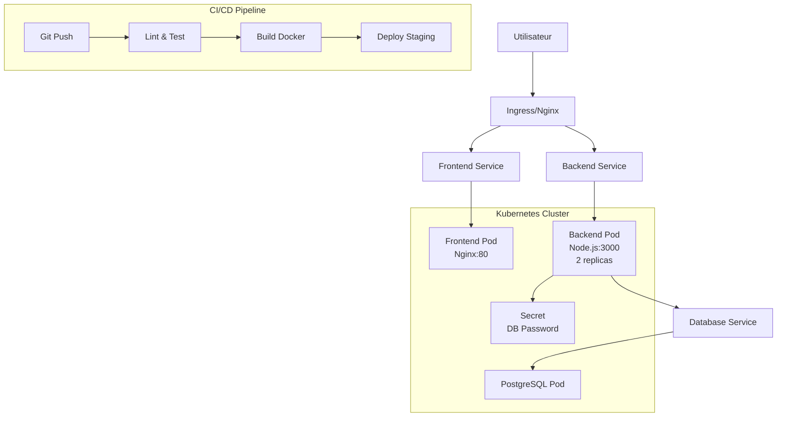

# VitalSync - Chaîne CI/CD Conteneurisée

## Description du Projet

VitalSync est une application web de suivi des activités vitales, composée d'un back-end API REST en Node.js/Express et d'un front-end statique servi par Nginx. L'application utilise une base de données PostgreSQL pour la persistance des données. Le projet démontre une implémentation complète de CI/CD avec conteneurisation Docker et orchestration Kubernetes.

## Architecture

L'architecture suit une approche microservices avec séparation claire des responsabilités :

- **Backend (Node.js/Express)** : API REST exposant des endpoints pour les données d'activités et un health check.
- **Frontend (Nginx)** : Serveur statique pour l'interface utilisateur, avec proxy vers l'API backend pour les requêtes `/api/*`.
- **Base de données (PostgreSQL)** : Stockage persistant des données.
- **CI/CD (GitHub Actions)** : Pipeline automatisée pour lint, tests, build Docker et déploiement staging.
- **Orchestration (Kubernetes)** : Déploiement en production avec scaling, secrets et ingress.

## Prérequis

Avant de lancer le projet, assurez-vous d'avoir installé :

- **Docker** : Version 20.10 ou supérieure
- **Docker Compose** : Version 2.0 ou supérieure
- **Node.js** : Version 18 (pour développement local uniquement)
- **Git** : Pour cloner le dépôt
- **kubectl** : Pour déploiement Kubernetes (optionnel)

## Installation et Lancement

### Avec Docker Compose (Recommandé)

1. Clonez le dépôt :
   ```bash
   git clone https://github.com/jilen15/vitalsync.git
   cd vitalsync
   ```

2. Lancez les services :
   ```bash
   docker-compose up -d
   ```

3. Accédez à l'application :
   - Frontend : http://localhost
   - Backend API : http://localhost:3000
   - Health check : http://localhost:3000/health

4. Arrêtez les services :
   ```bash
   docker-compose down
   ```

### Développement Local

1. Installez les dépendances du backend :
   ```bash
   cd backend
   npm install
   ```

2. Lancez le backend :
   ```bash
   npm start
   ```

3. Ouvrez `frontend/index.html` dans un navigateur.

## Pipeline CI/CD

La pipeline GitHub Actions s'exécute automatiquement sur chaque push vers `develop` et chaque Pull Request vers `main`. Elle comprend trois étapes :

### Étape 1 : Lint & Tests
- Installation des dépendances Node.js
- Exécution d'ESLint pour le linting du code
- Lancement des tests unitaires avec Jest

### Étape 2 : Build Docker
- Construction des images Docker pour backend et frontend
- Tag des images avec le SHA du commit
- Push vers GitHub Container Registry (GHCR)

### Étape 3 : Déploiement Staging
- Modification de docker-compose.yml pour utiliser les images poussées
- Démarrage des services en mode détaché
- Vérification de santé du backend via health check
- Arrêt des services après validation

La pipeline échoue si les tests, le lint ou le health check ne passent pas.

## Choix Techniques et Justifications

### Conteneurisation Docker
- **Multi-stage build** pour le backend : Réduit la taille de l'image finale (sécurité et performance) en excluant les dépendances de développement et les outils de test.
- **Alpine Linux** : Images légères pour optimiser l'utilisation des ressources.

### Orchestration
- **Docker Compose** : Simple pour le développement local et staging.
- **Kubernetes** : Scalabilité et gestion avancée en production (replicas, secrets, ingress).

### CI/CD
- **GitHub Actions** : Intégration native avec GitHub, facilité de configuration.
- **ESLint + Jest** : Qualité du code assurée par linting et tests automatisés.
- **Health checks** : Validation du déploiement avant mise en production.

### Sécurité
- **Secrets Kubernetes** : Stockage sécurisé des mots de passe (pas en clair dans les manifests).
- **Branch protection** : Pull Requests obligatoires sur main, empêchant les pushes directs.
- **Registry privé** : Images stockées dans GHCR avec authentification.

## Architecture Simplifiée



Cette architecture assure une séparation claire des responsabilités, une scalabilité horizontale et une sécurité renforcée grâce à la conteneurisation et l'orchestration.